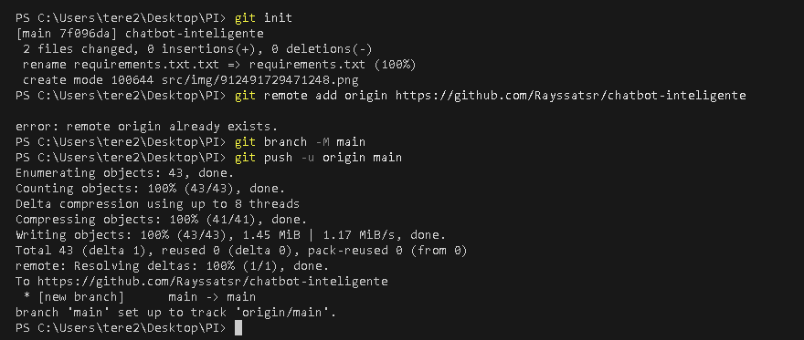
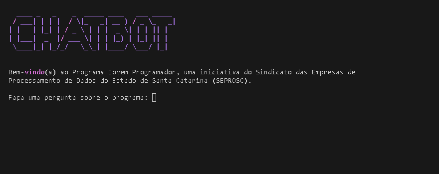

# Chatbot Jovem Programador

Chatbot local de perguntas e respostas baseado no conteúdo do programa Jovem Programador. O sistema utiliza análise semântica com o modelo `all-MiniLM-L6-v2` para identificar e retornar informações relevantes. Funciona completamente offline após a instalação.

---

## Visão geral

O chatbot extrai e organiza blocos de informação de um arquivo HTML estruturado. Ao receber uma pergunta, compara semanticamente com os textos disponíveis e retorna a resposta mais próxima com base em similaridade.

---

## Capturas de tela

Print do terminal com os comandos Git executados:


Exibição de resposta:


---

## Estrutura do projeto

```
PI/
│
├── index.py                # Script principal do chatbot
├── requirements.txt        # Lista de bibliotecas necessárias
└── src/
    ├── html/               # Contém o HTML fonte com os dados do programa
    └── img/                # Imagens usadas neste README
```

---

## Como executar

1. Clone este repositório ou baixe os arquivos.

```bash
git clone https://github.com/seu-usuario/seu-repositorio.git
cd seu-repositorio
```

2. Instale as dependências:

```bash
pip install -r requirements.txt
```

3. Verifique se o arquivo `Jovem_Programador.html` está presente na pasta `src/html/`.

4. Execute o programa:

```bash
python index.py
```

5. Faça perguntas relacionadas ao conteúdo. Para sair, digite `sair`.

---

## Requisitos

- Python 3.8 ou superior
- Git instalado
- Acesso à internet apenas para instalação de dependências

---

## Instruções para entrega

Para concluir esta atividade conforme as instruções recebidas:

1. Instale o Git em sua máquina: [https://git-scm.com](https://git-scm.com)
2. Crie uma conta no GitHub: [https://github.com](https://github.com)
3. Crie um repositório público com nome relacionado ao projeto (ex: `chatbot-jovem-programador`)
4. No terminal da sua IDE, navegue até a pasta do projeto e execute:

```bash
git init
git remote add origin https://github.com/seu-usuario/seu-repositorio.git
git add .
git commit -m "chatbot-inteligente"
git push -u origin master
```

5. Encaminhe:
   - Print do repositório com os arquivos inseridos
   - Print do terminal com os comandos Git executados

---

## Licença

Uso acadêmico. Desenvolvido para fins educacionais no contexto do programa Jovem Programador.
